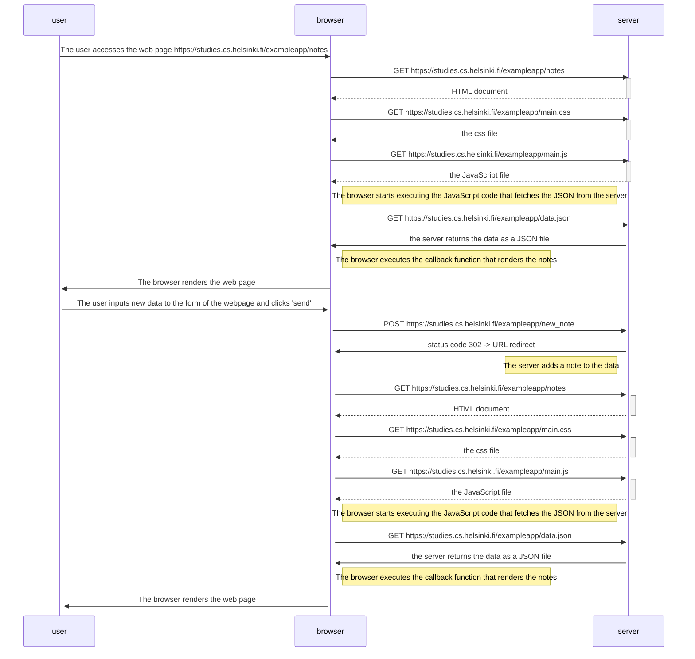

## 0.4: New note diagram
https://fullstackopen.com/en/part0/fundamentals_of_web_apps

This file contains the exercise 0.4 of the course in which it has to be represented in a diagram how the user creates a new note on the
page https://studies.cs.helsinki.fi/exampleapp/notes by writing something into the text field and clicking the submit button.

